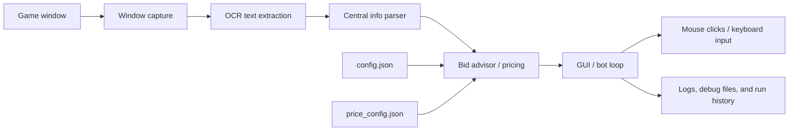
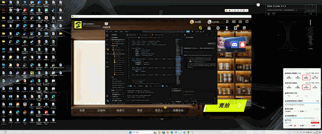
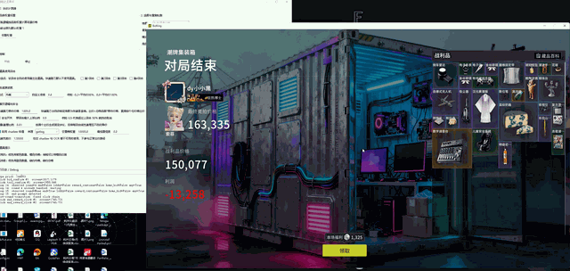

# BidKing Fresh Bot

<p align="center">
  
</p>

<p align="center">
  A Windows OCR automation assistant for BidKing that manages configuration in a GUI, reads in-game state, computes suggested bids, and performs window clicks and round transitions.
</p>

<p align="center">
  <a href="README.md">English</a> |
  <a href="README.zh-CN.md">中文</a>
</p>

<p align="center">
  
  
  
  
</p>

## Table of Contents

- [Project Overview](#project-overview)
- [Key Features](#key-features)
- [Architecture](#architecture)
- [Project Layout](#project-layout)
- [Dependencies](#dependencies)
- [Quick Start](#quick-start)
- [Run Modes](#run-modes)
- [Usage Examples](#usage-examples)
- [GIF Demos](#gif-demos)
- [FAQ](#faq)
- [Acknowledgements](#acknowledgements)
- [License](#license)

## Project Overview

BidKing Fresh Bot is an OCR-based automation tool for the Windows desktop game BidKing. It is aimed at users who run the game locally and want a GUI to manage settings, reduce manual JSON editing, and automate repetitive bidding steps.

Why this project exists:

- Read round numbers and auction state from the central game UI
- Convert OCR text into structured data
- Compute suggested bids from a price model and category weights
- Execute tool usage, bidding, confirmation, and round transitions automatically
- Keep day-to-day configuration, debugging, and manual calculations in one place

## Provenance

This repository is an integration and adaptation of two upstream open-source projects:

- [Bidking_bot](https://github.com/sarkozyfan/bidking-bot)
- [Bidking_shadow](https://github.com/zxTinF/bidking_shadow)

Some parts of this codebase are derived from or adapted from those projects, while other parts are original work written for this repository, including the GUI layer, workflow integration, configuration handling, and documentation.

## Key Features

- Full-window OCR polling for round numbers, end prompts, and lobby state
- Parsing for central info text, auction conditions, and item-related clues
- Suggested bid calculation using configurable unit prices, weights, and risk profiles
- GUI controls for map selection, run count, role, mode, and aggression level
- Tool-round selection, bid caps, safe guard rules, and sticky increment support
- Handling for end-of-match prompts, reward continue screens, auction lobby transitions, and home bid buttons
- Window focus and optional centering on startup to reduce capture and input failures
- A manual calculator page for validating the pricing model separately

## Architecture



The flow is straightforward:

1. Capture the game window.
2. OCR the central info area and supporting regions.
3. Parse the current round, UI state, and available item information.
4. Combine the configuration files and price model to compute a bid.
5. Use mouse and keyboard automation to complete the bid flow.

## Project Layout

```text
bidking-bot/
  README.md
  README.zh-CN.md
  README.en.md
  requirements.txt
  manual_bidking_advisor.py
  bidking_fresh_bot/
    bidking_gui.py
    fresh_bidking_bot.py
    config.json
    price_config.json
    start.ps1
    build_exe.ps1
  bidking_maa_test/
    central_info_parser.py
    window_backend.py
    analyze_screenshot.py
    roi_config.json
  bidking_shadow/
    getlog/
    item_prices.csv
  docs/
    assets/
      bidking-banner.svg
```

## Dependencies

Recommended setup:

- Windows 10 or Windows 11
- Python 3.11 or Python 3.12
- A desktop game window
- 1920x1080 layout for the default coordinates

The main third-party packages come from [requirements.txt](requirements.txt):

- Pillow
- numpy
- opencv-python
- pyautogui
- rapidocr-onnxruntime
- onnxruntime
- psutil
- pyinstaller

## Quick Start

Create a virtual environment and install dependencies:

```powershell
python -m venv .venv
.\.venv\Scripts\Activate.ps1
python -m pip install -r .\requirements.txt
```

If PowerShell blocks script execution, temporarily allow it for the current session:

```powershell
Set-ExecutionPolicy -Scope Process Bypass
```

## Run Modes

### Start the GUI from source

```powershell
cd .\bidking_fresh_bot
python .\bidking_gui.py
```

### Start via the included script

```powershell
powershell -ExecutionPolicy Bypass -File .\bidking_fresh_bot\start.ps1
```

### Build the EXE

```powershell
cd .\bidking_fresh_bot
powershell -ExecutionPolicy Bypass -File .\build_exe.ps1
```

The default output is usually:

```text
bidking_fresh_bot\dist\BidKingFreshBot_release.exe
```

## Usage Examples

### 1. Check the GUI settings first

After opening the GUI, verify:

- The map matches your current game scene
- The mode is correct for your run style
- The role is selected properly
- The tool rounds are checked as expected
- The safety settings and bid cap are acceptable

### 2. 3,000,000 bid cap

The project now caps the suggested bid at 3,000,000 by default. You can see it in the configuration:

```json
"automation": {
  "bid_cap_price": 3000000
}
```

This prevents the model from producing extreme bids.

### 3. Key configuration files

- [bidking_fresh_bot/config.json](bidking_fresh_bot/config.json)
- [bidking_fresh_bot/price_config.json](bidking_fresh_bot/price_config.json)

## GIF Demos

The following GIFs are ordered by recording time, so together they show a complete end-to-end flow:

### 1. 21:25:47



### 2. 21:34:55


### 3. 21:37:49


### 4. 21:40:41


### 5. 21:44:41


### 6. 21:50:48



Together, these clips cover launch, configuration, detection, and execution, which works well as a full-flow demo for the assignment.

## FAQ

### Why does the GUI not start running automatically?

The GUI is only the configuration and launch entry point. You still need to review the settings and click Start.

### Why does the bot fail to detect a round?

Usually the window capture target is wrong, or the game layout does not match the default ROI. Check the window title, resolution, scaling, and coordinates in config.json.

### Why is the suggested bid sometimes too high or too low?

The bid is affected by the price model, category weights, risk profile, safety limits, and the 3,000,000 cap. Use the manual calculator tab to inspect the inputs.

### Why did my JSON changes not take effect?

Make sure you edited the file the running process actually uses. The safest path is to change settings through the GUI and restart if needed.

### Why does the bot skip some rounds?

A round may already be handled, or it may be blocked by debounce logic, the safety guard, or an end-prompt transition. The log panel will show the reason.

### Do I have to use 1920x1080?

No, but the default coordinates and capture regions are tuned for 1920x1080. Other resolutions usually require recalibration.

## Acknowledgements

Thanks to the following projects and ideas:

- bidking_shadow: https://github.com/zxTinF/bidking_shadow
- bidking-bot: https://github.com/sarkozyfan/bidking-bot

This repository integrates the GUI, OCR, pricing advice, and automation flow on top of those ideas.

## License

This project is released under the MIT License. See [LICENSE](LICENSE).
