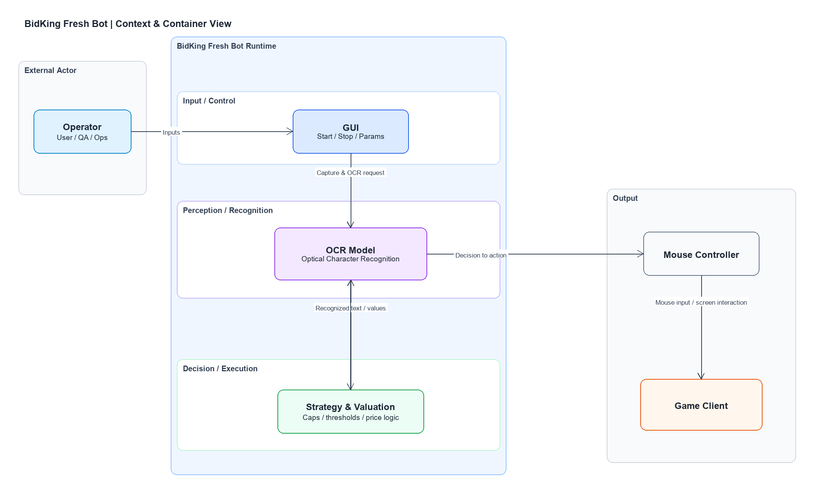
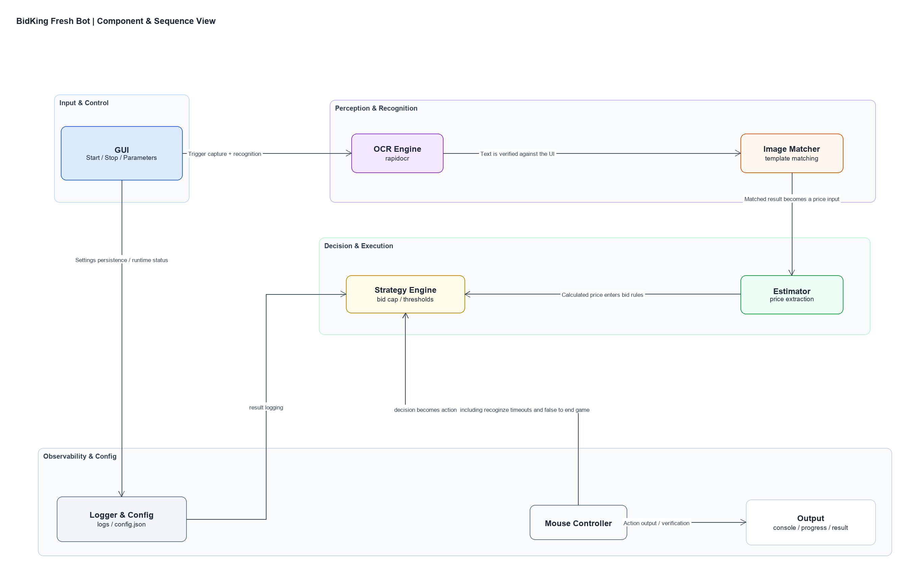

# BidKing Fresh Bot

<p align="center">
  
</p>

<p align="center">
  A Windows OCR automation assistant for BidKing that manages configuration in a GUI, reads in-game state, computes suggested bids, and performs window clicks and round transitions.
</p>

<p align="center">
  <a href="README.md">English</a> |
  <a href="README.zh-CN.md">中文</a>
</p>

<p align="center">
  
  
  
  
</p>

## Table of Contents

- [Project Overview](#project-overview)
- [Why This Project Exists](#why-this-project-exists)
- [Provenance](#provenance)
- [Key Features](#key-features)
- [Architecture](#architecture)
- [Project Layout](#project-layout)
- [Requirements](#requirements)
- [Install](#install)
- [Running It Next to the Game](#running-it-next-to-the-game)
- [Usage Walkthrough: One Full Run](#usage-walkthrough-one-full-run)
- [FAQ](#faq)
- [Acknowledgements](#acknowledgements)
- [License](#license)

## Project Overview

BidKing Fresh Bot is an OCR-based automation tool for the Windows desktop game BidKing. It reads the auction screen, decides what to bid, and drives the mouse and keyboard so a full match runs without you watching it. Everything is controlled from a single Tkinter GUI — you pick the map, mode, role, and risk level, press **开启 (Start)**, and the bot takes over the round-by-round bidding loop.

## Why This Project Exists

This is not "yet another bot." It exists to close a specific gap left by its two upstream projects.

- [bidking-bot](https://github.com/sarkozyfan/bidking-bot) solves the **clicking** half — the input-automation loop — but you configure it by hand-editing JSON and running scripts from a terminal.
- [bidking_shadow](https://github.com/zxTinF/bidking_shadow) solves the **valuation** half — reading game logs and pricing loot from drop tables — but it lives as standalone CSVs and scripts, disconnected from any live bidding loop.

Both assume a developer at a command line, and neither gives you one place to actually *play a match*. This repository fuses the two and adds the layer that makes them usable as a product:

- **One GUI for every knob.** Map, mode, role, aggression, tool rounds, bid cap, safety, and shadow valuation are all toggles and dropdowns — you never edit `config.json` by hand to play.
- **Valuation wired into the live loop.** A bridge feeds bidking_shadow's per-item estimates straight into the bid the bot is about to type, instead of leaving it as an offline calculation.
- **Resolution independence.** Every click and capture region is stored against a 1920×1080 reference and **auto-scaled** to your real window size, so the bot survives windows that aren't exactly reference-sized.
- **A packaged EXE.** `build_exe.ps1` produces a single file that bundles Python and the OCR models, so it runs on a Windows machine with no development environment.
- **A manual-calculator tab** to sanity-check the pricing model on its own, separate from a live run.

In short: it turns two developer-facing scripts into something a player can launch and run end to end.

## Provenance

This repository is an integration and adaptation of the two upstream open-source projects above:

- [Bidking_bot](https://github.com/sarkozyfan/bidking-bot)
- [Bidking_shadow](https://github.com/zxTinF/bidking_shadow)

Some parts of this codebase are derived from or adapted from those projects, while other parts are original work written for this repository, including the GUI layer, the shadow-valuation bridge, workflow integration, configuration handling, resolution scaling, and documentation.

## Key Features

- Full-window OCR polling for round numbers, end prompts, and lobby state
- Parsing of the central info panel into structured auction facts (round, category, price clues)
- Suggested-bid calculation from configurable unit prices, category weights, and a risk profile
- GUI controls for map, run count, role, mode, and aggression — no manual JSON editing
- Tool-round selection, a hard bid cap, an optional safe-guard, and sticky-increment growth
- Handling for end-of-match prompts, reward-continue screens, lobby transitions, and home-bid buttons
- Window focus and optional centering on startup to reduce capture and input failures
- A manual calculator tab for validating the pricing model on its own

## Architecture

The diagrams below are exported from the draw.io sources in [docs/architecture/](docs/architecture). Every arrow is labelled with **what it carries**, and components are grouped into the lanes that own them.

**Context & container view** — the operator drives the GUI; the runtime captures and OCRs the screen, turns recognised text into a valuation decision, and acts on the game through the mouse controller.



**Component & sequence view** — the same flow at component granularity: the GUI triggers capture and recognition, the OCR engine and image matcher hand a price input to the estimator, the strategy engine applies caps and thresholds, and the mouse controller acts while the logger persists config and results.



Read as five steps: **capture** the window → **OCR + parse** the center panel → **value** the lot → **apply** risk/cap → **act** with mouse and keyboard, looping until the run count is reached.

## Project Layout

```text
bidking-bot/
  README.md
  README.zh-CN.md
  README.en.md
  requirements.txt
  manual_bidking_advisor.py        # pricing model + manual advisor
  bidking_fresh_bot/
    bidking_gui.py                 # Tkinter GUI (the entry point you run)
    fresh_bidking_bot.py           # bot loop / state machine
    bidking_shadow_bridge.py       # wires shadow valuation into the loop
    config.json                    # coordinates, timing, modes, caps
    price_config.json              # grid prices + category weights
    start.ps1                      # run the bot loop headless
    build_exe.ps1                  # package the one-file EXE
  bidking_maa_test/
    window_backend.py              # Win32 capture + coordinate scaling
    central_info_parser.py         # OCR text -> structured facts
    analyze_screenshot.py          # overlay ROI boxes on a screenshot
    roi_config.json
  bidking_shadow/
    getlog/
    item_prices.csv
  docs/
    assets/
      bidking-banner.svg
      demos/                       # the walkthrough GIFs
```

## Requirements

- Windows 10 or Windows 11
- Python 3.11 or Python 3.12
- The BidKing game running in **windowed** mode
- A 1920×1080 game window matches the default coordinates best; other sizes are auto-scaled from that reference

Main third-party packages (from [requirements.txt](requirements.txt)): Pillow, numpy, opencv-python, pyautogui, rapidocr-onnxruntime, onnxruntime, psutil, pyinstaller.

## Install

Create a virtual environment and install dependencies:

```powershell
python -m venv .venv
.\.venv\Scripts\Activate.ps1
python -m pip install -r .\requirements.txt
```

If PowerShell blocks script execution, allow it for the current session only:

```powershell
Set-ExecutionPolicy -Scope Process Bypass
```

## Running It Next to the Game

The bot drives the **real** game window, so BidKing must be open the whole time it runs.

1. Launch BidKing in **windowed** mode, ideally at 1920×1080.
2. The bot finds the window by the title keyword `"BidKing"` (`window.title_keyword` in `config.json`). If several windows match, set `window.hwnd` to target one exactly.
3. On **开启 (Start)** it brings that window to the front and, by default, centers it (`window.center_on_start`) so input and capture line up. **Don't move or cover the window while it runs.**

### After building the EXE

`build_exe.ps1` produces a single self-contained file:

```powershell
cd .\bidking_fresh_bot
powershell -ExecutionPolicy Bypass -File .\build_exe.ps1
# output: bidking_fresh_bot\dist\BidKingFreshBot_release.exe
```

That EXE bundles Python, the OCR models, `config.json`, and `price_config.json`, so it runs on a Windows machine **with no Python installed**. To use it:

1. Launch BidKing (windowed).
2. Double-click `BidKingFreshBot_release.exe`. The **same GUI** opens — it behaves exactly like `python bidking_gui.py`.
3. Choose your settings in the GUI and click **开启 (Start)**.

To change the baked-in defaults the EXE ships with, edit `config.json` / `price_config.json` and rebuild.

### Other ways to launch

```powershell
# Run the bot loop headless (no GUI), using config.json
powershell -ExecutionPolicy Bypass -File .\bidking_fresh_bot\start.ps1
```

## Usage Walkthrough: One Full Run

This is what an actual end-to-end run looks like. Each GIF is placed at the step it illustrates; the clips were recorded as one continuous session, so together they cover launch → bidding → match end.

### Step 0 — Launch the assistant beside the game

```powershell
cd .\bidking_fresh_bot
python .\bidking_gui.py
```


*The assistant (left) running from source next to the game at the auction lobby (right). The green **竞拍** button is the entry the bot clicks to enter a room.*

### Step 1 — Set up the run in the 自动化 (Automation) tab

Before pressing Start, set:

- **地图 (Map)** — the map you're farming, e.g. `1. 快递盲盒堆`.
- **模式 (Mode)** — `标准模式` (normal) or `快递跑刀` (express, which auto-locks the map to 快递盲盒堆 and bids `item count × per-item price`).
- **角色 (Role)** — currently `爱莎`.
- **重复次数 (Repeat count)** — how many matches to run before stopping.
- **6. 拍卖激进度 (Aggression)** — `保守` (floor price), `均衡` (average), `激进` (average +25%), or `自定义` with a custom multiplier (e.g. `-0.2` = 80% of average, `0.8` = 180%).
- **5. 道具使用回合 (Tool rounds)** — tick the rounds that should auto-use the leftmost tool.
- Optional safety in **4. 爱莎逻辑与安全**: the **安全开关 (safe-guard)** caps how much a bid may jump round-over-round, and **防黏递增 (sticky increment)** forces steady linear growth. The hard **bid cap** defaults to 3,000,000.

### Step 2 — Press 开启 (Start)

The bot attaches to the game window, centers it, and begins polling — from here it drives the lobby → round → bid → end-of-match loop on its own.

### Step 3 — Round 1: read the center panel and price the lot


*Round 1. The bot OCRs the center info panel (character **艾莎** and the auction conditions), parses it into facts, and computes a suggested bid before touching the **出价** button.*

### Step 4 — Bid submitted


*Bid placed. The bottom shows **已出价** (submitted) and the right shows **当前预估最低价** (the estimated floor) — the number the price model is steering toward.*

### Step 5 — Mid rounds: per-category valuation


*A later round. The auction-info popup gives a category average (here gold-quality average = 41270). The advisor applies your category weights and re-prices the lot every round.*

### Step 6 — Round 4: the decisive, competitive round


*Round 4 — the round that usually decides the lot. Rival bids stack up on the left; the bot's bid (**已出价 144653**) is set to clear the estimated floor (50,757) without exceeding the 3,000,000 cap.*

### Step 7 — Match end: settle and continue


***对局结束** (match over). The bot handles the settlement screen, clicks through to continue, then either starts the next match or exits once **重复次数** is reached.*

### A note on the bid cap

The suggested bid is capped at 3,000,000 by default so the model can't produce an extreme bid. You can see it in [bidking_fresh_bot/config.json](bidking_fresh_bot/config.json):

```json
"automation": {
  "bid_cap_price": 3000000
}
```

The two files that drive every decision are [bidking_fresh_bot/config.json](bidking_fresh_bot/config.json) (coordinates, timing, modes, caps) and [bidking_fresh_bot/price_config.json](bidking_fresh_bot/price_config.json) (grid prices and category weights).

## FAQ

### Why doesn't the GUI start running on its own?

The GUI is only the configuration and launch entry point. Review the settings, then click **开启 (Start)** to begin the loop.

### Why does the bot fail to detect a round?

Usually the wrong window is captured, or the game layout doesn't match the default regions. Check the window title, resolution, and scaling. Coordinates auto-scale from the 1920×1080 reference, but if clicks land in the wrong spot you can run `python fresh_bidking_bot.py --print-clicks` to see where each click resolves and adjust the matching entry in `config.json`.

### Why is the suggested bid sometimes too high or too low?

The bid depends on the price model, category weights, the risk profile, the safety limits, and the 3,000,000 cap. Use the manual calculator tab to inspect the inputs.

### Why didn't my JSON change take effect?

Make sure you edited the file the running process actually uses. The safest path is to change settings through the GUI and restart if needed. The packaged EXE uses the `config.json` baked in at build time — rebuild to change its defaults.

### Why does the bot skip some rounds?

A round may already be handled, or it may be blocked by the debounce logic, the safe-guard, or an end-prompt transition. The log panel shows the reason (e.g. `round X already handled; waiting` or `bid skipped: ...`).

### Do I have to use 1920×1080?

No. The defaults are tuned for 1920×1080, but coordinates auto-scale to other sizes. Very different layouts may still need a coordinate adjustment in `config.json`.

## Acknowledgements

Thanks to the following projects and ideas:

- bidking_shadow: https://github.com/zxTinF/bidking_shadow
- bidking-bot: https://github.com/sarkozyfan/bidking-bot

This repository integrates the GUI, OCR, pricing advice, and automation flow on top of those projects.

## License

This project is released under the MIT License. See [LICENSE](LICENSE).
