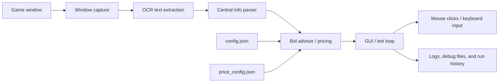

# BidKing Fresh Bot

<p align="center">
  
</p>

<p align="center">
  Windows 上的 BidKing OCR 自动化助手，用 GUI 管理配置、识别界面状态、计算建议出价，并执行窗口点击与回合流程。
</p>

<p align="center">
  <a href="README.md">English</a> |
  <a href="README.zh-CN.md">中文</a>
</p>

<p align="center">
  
  
  
  
</p>

## 目录

- [项目简介](#项目简介)
- [核心功能](#核心功能)
- [架构图](#架构图)
- [项目结构](#项目结构)
- [依赖环境](#依赖环境)
- [快速开始](#快速开始)
- [运行方式](#运行方式)
- [使用示例](#使用示例)
- [GIF 演示](#gif-演示)
- [FAQ](#faq)
- [致谢](#致谢)
- [许可证](#许可证)

## 项目简介

BidKing Fresh Bot 是一个面向 Windows 桌面端《竞拍之王 / BidKing》的 OCR 识别与自动化工具。它适合已经在本机跑游戏窗口、并且希望用图形界面统一管理参数、减少手动改 JSON 的用户。

这个项目存在的原因很直接：

- 从游戏中央信息区读取回合和拍卖信息
- 通过 OCR 和文本解析把界面内容转成结构化数据
- 基于价格模型和品类权重计算建议出价
- 自动执行道具、出价、确认、回合切换等窗口操作
- 用 GUI 把日常配置、调试和手动计算集中在同一个入口里

## 核心功能

- 整窗 OCR 轮询，识别当前回合、结束提示和大厅状态
- 解析中央信息区文本并提取拍卖条件、品类与价格线索
- 根据可配置的单格价格、权重和激进度计算建议出价
- 支持 GUI 中直接切换地图、轮数、角色、模式和风险偏好
- 支持道具使用回合、出价硬顶、安全上浮限制和防黏递增
- 处理“对局结束”、“奖励继续”、“竞拍大厅”、“首页竞拍按钮”等过渡界面
- 启动时把游戏窗口拉到前台并可选居中，减少识别和输入失败
- 提供手动计算器页，便于单独验证价格模型

## 架构图



流程可以理解为：

1. 读取游戏窗口画面。
2. OCR 提取中央信息区和辅助区域文本。
3. 解析当前回合、界面状态和可用物品信息。
4. 结合配置文件和价格模型，计算建议出价。
5. 通过窗口点击和键盘输入完成道具与拍卖流程。

## 项目结构

```text
bidking-bot/
  README.md
  README.zh-CN.md
  README.en.md
  requirements.txt
  manual_bidking_advisor.py
  bidking_fresh_bot/
    bidking_gui.py
    fresh_bidking_bot.py
    config.json
    price_config.json
    start.ps1
    build_exe.ps1
  bidking_maa_test/
    central_info_parser.py
    window_backend.py
    analyze_screenshot.py
    roi_config.json
  bidking_shadow/
    getlog/
    item_prices.csv
  docs/
    assets/
      bidking-banner.svg
```

## 依赖环境

推荐环境：

- Windows 10 或 Windows 11
- Python 3.11 或 Python 3.12
- 桌面端游戏窗口
- 1920x1080 布局更容易直接复用默认坐标

主要第三方依赖来自 [requirements.txt](requirements.txt)，包括：

- Pillow
- numpy
- opencv-python
- pyautogui
- rapidocr-onnxruntime
- onnxruntime
- psutil
- pyinstaller

## 快速开始

建议先创建虚拟环境并安装依赖：

```powershell
python -m venv .venv
.\.venv\Scripts\Activate.ps1
python -m pip install -r .\requirements.txt
```

如果你的执行策略限制了脚本，可先在 PowerShell 中临时放行当前会话：

```powershell
Set-ExecutionPolicy -Scope Process Bypass
```

## 运行方式

### 从源码启动 GUI

```powershell
cd .\bidking_fresh_bot
python .\bidking_gui.py
```

### 通过脚本启动

```powershell
powershell -ExecutionPolicy Bypass -File .\bidking_fresh_bot\start.ps1
```

### 打包 EXE

```powershell
cd .\bidking_fresh_bot
powershell -ExecutionPolicy Bypass -File .\build_exe.ps1
```

打包成功后，默认输出通常是：

```text
bidking_fresh_bot\dist\BidKingFreshBot_release.exe
```

## 使用示例

### 1. GUI 启动后先检查配置

打开 GUI 后，建议先确认以下内容：

- 地图是否与当前游戏场景一致
- 模式是否为“标准模式”或“快递跑刀”
- 角色是否正确
- 道具回合是否勾选
- 安全开关和出价上限是否符合你的预期

### 2. 300w 出价上限

当前项目默认会对建议出价做 300w 封顶。你可以在配置中看到：

```json
"automation": {
  "bid_cap_price": 3000000
}
```

这能防止模型在极端情况下生成过高的出价。

### 3. 关键配置文件

- [bidking_fresh_bot/config.json](bidking_fresh_bot/config.json)
- [bidking_fresh_bot/price_config.json](bidking_fresh_bot/price_config.json)

## GIF 演示

作业要求至少两段 GIF。这里先给出推荐位置，你可以录制后替换为真实文件：

### GIF 1: GUI 启动与主界面


建议录制内容：

- 启动 GUI
- 切换地图、模式、角色
- 查看日志区和手动计算器页

### GIF 2: 运行一轮自动化流程


建议录制内容：

- 识别当前回合
- 计算建议出价
- 自动执行出价或显示安全拦截

如果你还没有 GIF，可以先保留占位，后续把录制结果保存到上面两个路径。

## FAQ

### 为什么 GUI 启动后没有立即开始运行？

GUI 只是配置与启动入口。你需要先检查参数，再点击“开启”按钮开始自动化循环。

### 为什么程序识别不到回合？

通常是窗口没有被正确捕获，或者游戏界面和默认 ROI 不一致。先检查窗口标题、分辨率、缩放比例和 `config.json` 里的坐标。

### 为什么建议出价有时会偏低或偏高？

建议出价会受价格模型、品类权重、风险偏好、上浮限制和 300w 封顶影响。你可以在手动计算器页检查输入是否完整。

### 为什么我改了 JSON 但行为没变化？

请确认你改的是正在运行的那一份配置文件，并且 GUI 没有在你保存后又写回覆盖。最稳妥的方式是通过 GUI 修改后再启动。

### 为什么程序会跳过某些回合？

某些回合可能已被处理过，或者被安全开关、去抖动逻辑、结束提示检测拦截。日志区会写出原因。

### 我必须使用 1920x1080 吗？

不是必须，但当前默认坐标和 ROI 更适合 1920x1080。分辨率不同通常需要重新校准点击位置和截图区域。

## 致谢

感谢以下开源项目和思路来源：

- bidking_shadow: https://github.com/zxTinF/bidking_shadow
- bidking-bot: https://github.com/sarkozyfan/bidking-bot

本项目在此基础上整合了 GUI、OCR、价格建议和自动化流程。

## 许可证

本项目使用 MIT License 开源，详见 [LICENSE](LICENSE)。
